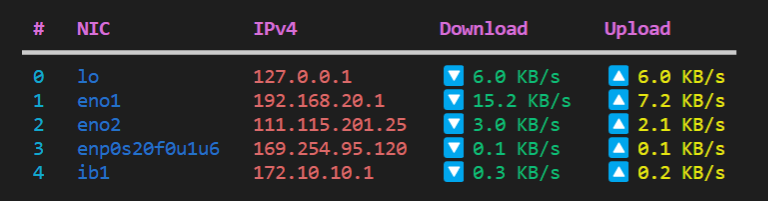
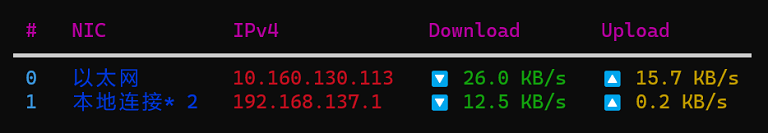

# NetSM


[](https://www.codacy.com/gh/XavierJiezou/NetSM/dashboard?utm_source=github.com&amp;utm_medium=referral&amp;utm_content=XavierJiezou/NetSM&amp;utm_campaign=Badge_Grade)


[](https://github.com/XavierJiezou/NetSM/stargazers)
[](https://github.com/XavierJiezou/NetSM/network)
[](https://github.com/XavierJiezou/NetSM/issues)
[](https://github.com/XavierJiezou/NetSM/blob/main/LICENSE)

Cross-platform lib for network speed monitoring in Python.

## Demo

### Linux



### Windows



## Install

```bash
pip install netsm
```

## Usage

`$ netsm show`

## Changelog

See [CHANGELOG.md](CHANGELOG.md)

## License

[MIT License](License)

## References

- [gpustat](https://github.com/wookayin/gpustat)
- [Python Packaging User Guide](https://packaging.python.org/en/latest/tutorials/packaging-projects/)
- [psutil documentation](https://psutil.readthedocs.io/en/latest/#network)
